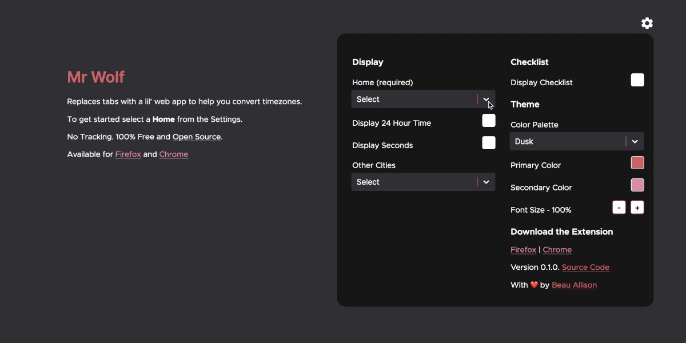

# Mr Wolf


[](https://percy.io/beauallison/mrWolf)

Browser Extension and Web App made with React, Emotion, & TypeScript for helping you sync timezones across the globe.



## Web Version

https://mrwolf.app

## Desktop Browser Extensions

Available on the Extension Stores for

- [Firefox](https://addons.mozilla.org/en-GB/firefox/addon/mr-wolf-app/)

- [Chrome](https://chrome.google.com/webstore/detail/mr-wolf/jkelocfjplnpcpjnmbamgfohobillnhf/)

- [Edge](https://microsoftedge.microsoft.com/addons/detail/mr-wolf/ihalkbldgbodccfefbohcfeckdgdodgo)

## Features List

| Feature                      |   Status    |
| ---------------------------- | :---------: |
| >6000 Cities                 |     ✅      |
| 24 Hour Time Toggle          |     ✅      |
| Display Seconds Toggle       |     ✅      |
| Browser Storage & Sync       |     ✅      |
| Web Version                  |     ✅      |
| Firefox Extension            |     ✅      |
| Chrome Extension             |     ✅      |
| Edge Extension               |     ✅      |
| Theme Support                |     ✅      |
| Custom Font Sizes            |     🔜      |
| Plus / Minus Time Calculator |     🔜      |
| Checklist                    | Coming Soon |

## Running Locally

This app requires Node and NPM to build and run.

### 1. Build

```sh
git clone https://github.com/beauallison/mrWolf/
cd mrWolf
npm install
npm run watch
```

### 2. Run

1. Open Firefox
2. Open `about:debugging`
3. Click `This Firefox`
4. Click `Load Temporary Add-on...`
5. Open the `build` folder in the project directory

For more information view the instructions at [Mozilla](https://developer.mozilla.org/en-us/docs/tools/about:debugging)

## Contributions

I would love your feedback! Please raise issues or if you would like to contribute raise any PRs for fixes you find.

## Acknowledgements

- Cities and timezones data set from [GeoNames](https://download.geonames.org/export/dump/)

- Countries data set from [Goodtables](https://goodtables.io/github/datasets/country-codes)

- Build process is based off the work by Eugene Dzhumak and their [React Web Extension Boilerplate](https://github.com/elforastero/react-browser-extension-boilerplate)

- World Clock Icon by [Creative Stall](https://thenounproject.com/creativestall/)
